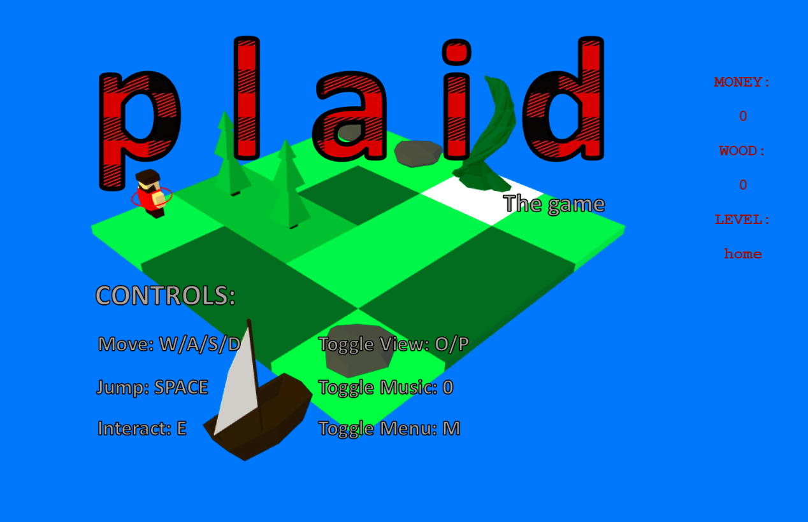

# Plaid

3D Lumberjack Life Simulator Game made for a GameJam competition written using Javascript, CSS and the THREE.js library (https://threejs.org/).

Authors: Will Foster-Hall, Reuben Bishop 

To run the game follow this link:

wfosterhall.github.io/Plaid
 

